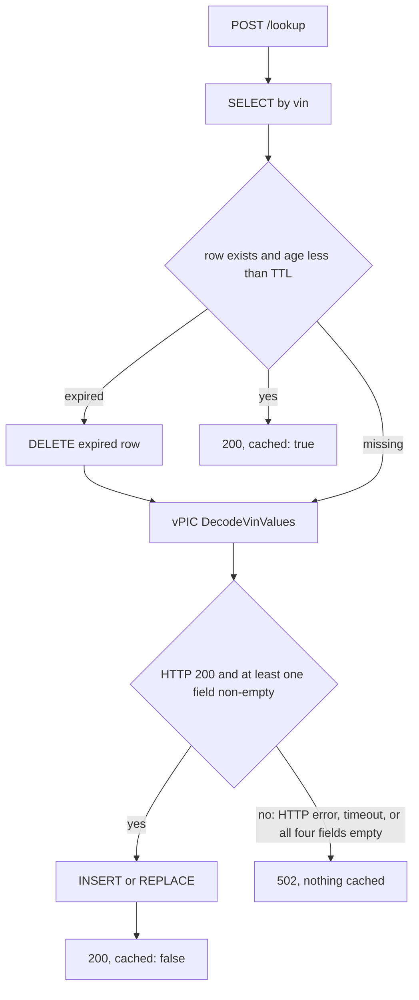
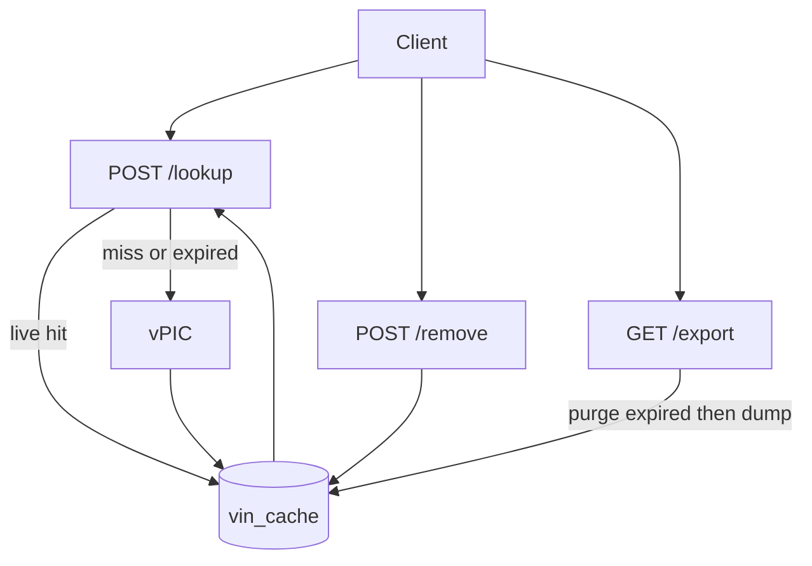

# Simple VIN Decoder Service

A FastAPI app that caches NHTSA vPIC VIN decodes in one SQLite table. JSON, SQL, and parquet use the same column names. `cached` is computed, never stored. The only extra stored field is `cached_at`, for lazy TTL.

This document is a decision log, not just a final-state spec: each design choice below lists the alternatives that were actually on the table, what they'd have cost, and why the chosen option won. The historical build order and per-file "done" record live in [CHECKLIST.md](../../CHECKLIST.md); the interview-facing tradeoffs and production discussion live in [NOTES.md](../../NOTES.md). Live walkthroughs of the hard-to-see cache decisions are `scripts/demo_concurrency_and_cache_cap.py` and `scripts/demo_ttl.py`.

## API schema

Lookup and remove are **POST with JSON**. Export is **GET** with no input. VIN: exactly 17 alphanumeric characters, normalized to **uppercase** before any cache key is used.

Snake_case JSON (not the README's display labels). Same names as the table, so there is one schema to remember.

| Option | Tradeoff |
|---|---|
| A. `GET /lookup?vin=...` | RESTful for a read, trivially curl/browser-friendly — but the assignment's wording ("the request should contain a single string called `vin`") reads as a body, and a VIN sitting in a query string ends up in server access logs and browser history |
| B. `POST /lookup` with a JSON body **(chosen)** | Matches the assignment's own wording directly; keeps the VIN out of URLs and logs. Costs some convenience — can't just paste a URL into a browser, worked around with the Phase 6 demo page |

**Why B.** Independent of how the assignment phrases it, a POST body keeps a per-vehicle identifier out of URLs — no VIN in server access logs or browser history. The assignment's own wording ("contain a single string") also reads as a body rather than a query parameter, so the two reasons point the same way. `/remove` mirrors `/lookup` for consistency, even though a `DELETE` verb would be more RESTful — the assignment frames all three as fixed named routes, not a resource-oriented API. `/export` stays `GET` because it takes no input and needs to be trivially downloadable (`curl -O -J`, or a plain browser link).

**POST `/lookup`**

Request:

```json
{"vin": "1HGCM82633A004352"}
```

Response:

```json
{
  "vin": "1HGCM82633A004352",
  "make": "HONDA",
  "model": "Accord",
  "model_year": "2003",
  "body_class": "Sedan/Saloon",
  "cached": false
}
```

`cached` is true only when a **live** (unexpired) row was found. It is not a column.

**POST `/remove`**

Request: `{"vin": "..."}`

Response:

```json
{"vin": "1HGCM82633A004352", "deleted": true}
```

`deleted` is true if a row was removed, false if it was not in the cache. HTTP 200 either way.

**GET `/export`**

Parquet attachment of live cache rows only. Columns: `vin`, `make`, `model`, `model_year`, `body_class`. No `cached`, no `cached_at`. Suggested filename is `vin_cache_<UTC timestamp>.parquet` (`_export_filename` in `app/routes.py`), not a fixed `vin_cache.parquet` — the original name, since every export suggests the identical name, meant repeat exports silently overwrote each other on disk (`curl -O -J` always overwrites; some browsers do too, depending on download settings).

| Option | Tradeoff |
|---|---|
| A. Fixed `vin_cache.parquet` (original) | Simplest possible code | Every export collides with the last; no way to tell two downloads apart or know when either was taken |
| B. UTC timestamp in the filename **(chosen)** | Sortable if you accumulate several (`YYYYMMDDTHHMMSSZ` sorts lexicographically = chronologically); tells you *when* an export was taken, not just that it's distinct; needs no state | Two exports within the same second still collide — second-precision, not a uniqueness guarantee |
| C. A persistent counter/sequence number | Guaranteed-unique regardless of timing | Needs somewhere to persist the counter (a file, a DB row) across restarts — new state for a problem a timestamp already solves for any realistic human export cadence |
| D. A random UUID | Guaranteed-unique, no shared state needed | Tells you nothing about *when* — a worse fit for "I exported this twice, which one is newer" than a timestamp |
| E. A content hash of the exported rows | Two exports with unchanged data get the *same* filename, which is arguably a feature (no duplicate downloads of identical content) | Adds a hashing step for a benefit (dedup) nobody asked for; still collides if the content is unchanged but the reviewer wanted proof of *when* they checked |

**Why B.** It directly answers "which export is this" (chronologically) with zero new state, unlike C or D, and unlike E it doesn't add a step to solve a problem (content dedup) that isn't the one being asked about. The colon in a standard ISO-8601 timestamp (`15:30:45`) is illegal in a Windows filename, so the format is `YYYYMMDDTHHMMSSZ` — compact, sortable, filesystem-safe everywhere — deliberately not a reuse of `db.utcnow_iso()`'s `+00:00`-suffixed style, which is fine for a SQL column but not for a filename. Same-second collisions are accepted as a known limit, not silently ignored: a human clicking "export" twice in under a second is not a real usage pattern this needs to defend against.

Pydantic models in [`app/schemas.py`](../../app/schemas.py):

- `VinRequest` — `vin: str` with length/charset constraint
- `LookupResponse` — the six lookup fields
- `RemoveResponse` — `vin`, `deleted`

## VIN validation

Pattern: `^[A-Z0-9]{17}$`, applied after uppercasing and stripping whitespace.

| Option | Tradeoff |
|---|---|
| A. Real VIN charset, excluding `I`/`O`/`Q` (`[A-HJ-NPR-Z0-9]{17}`) | Closer to a real VIN — those three letters never appear in one, precisely so they can't be confused with `1`/`0`. But it rejects input the assignment explicitly says to accept ("17 alphanumeric characters"), before vPIC ever gets a chance to say whether the VIN is decodable |
| B. Assignment-literal `[A-Z0-9]{17}` **(chosen)** | Matches the stated requirement exactly. A syntactically valid but semantically nonsense VIN is caught downstream instead — by the vPIC undecodable-VIN check added in Phase 7 (see "vPIC client" below), not at the validation layer |

**Why B.** Validation's job here is to enforce the assignment's contract, not to encode extra VIN-format knowledge the spec didn't ask for. Overriding it with real-world VIN rules would mean silently rejecting input the assignment says should be accepted. Whether a VIN is *real* is vPIC's call, not the request validator's.

## Persistence schema

One table. Four decode fields plus the timestamp needed for TTL. Nothing else (no error codes, no raw vPIC payload, no `cached` flag).

```sql
CREATE TABLE vin_cache (
  vin         TEXT PRIMARY KEY,
  make        TEXT NOT NULL,
  model       TEXT NOT NULL,
  model_year  TEXT NOT NULL,
  body_class  TEXT NOT NULL,
  cached_at   TEXT NOT NULL
);
CREATE INDEX ix_vin_cache_cached_at ON vin_cache (cached_at);
```

`cached_at` is UTC ISO-8601, always produced by this module's own `utcnow_iso`/`_format_iso` (same precision, same `+00:00` offset every time), which is what lets `purge_expired` and `enforce_size_cap` both compare/sort it as a plain string in SQL rather than parsing every row back into a `datetime` in Python. It's indexed because both maintenance functions filter or sort by it on every sweep tick — the only non-PK column either one queries.

Missing vPIC values are stored as `""`, not NULL, so parquet and JSON stay uniform.

| Option | Tradeoff |
|---|---|
| A. Raw `aiosqlite` + hand-written SQL | Fewer dependencies, fully explicit about every query that runs — but connection lifecycle and row-to-object mapping are boilerplate we'd hand-roll for not much payoff on a single table |
| B. SQLAlchemy 2.0 async ORM + `aiosqlite` driver **(chosen)** | Schema is one declarative class instead of hand-written DDL and mapping code; session/transaction handling is library code, not ours; leaves a clear migration path to Postgres later (see NOTES.md, "If this had to handle real traffic") without touching the model layer |

**Why B.** One table alone doesn't justify an ORM, but the async engine/session machinery is needed either way to share a connection pool safely across concurrent async requests — SQLAlchemy gets that for free, plus a straightforward path off SQLite if this ever needed to scale.

## Cache expiration

**Lazy TTL + delete-on-read, backed by a lightweight in-process periodic sweep.** Env var `CACHE_TTL_SECONDS`, default **7 days** (`604800`).

| Option | Tradeoff |
|---|---|
| A. No expiration — cache forever | Simplest possible code. But a bad cached decode never self-heals, and the table grows without bound |
| B. Lazy TTL, delete-on-read, plus a lightweight in-process periodic sweep and a row-count cap **(chosen)** | No new infrastructure — the sweep is an `asyncio` task inside the same process, started and cancelled in the app's own lifespan. Bounds both staleness (TTL) and absolute size (row cap), instead of leaving both purely opportunistic. Cost: the sweep and cap are enforced on an interval (`CACHE_SWEEP_INTERVAL_SECONDS`, default hourly), not instantly on every write — the table can transiently exceed the cap between ticks |
| C. Background purge via a real scheduler (Celery beat, k8s CronJob, cron hitting an admin route) | Keeps storage tight independent of the app process's own lifetime — but adds a new deployable / infrastructure dependency for a cache that's realistically small in this context |
| D. Scheduled refresh (re-fetch every cached VIN periodically, regardless of access) | Keeps data maximally fresh — wasteful, since VIN attributes essentially never change; most refetches would be pointless vPIC calls |

**Why B.** VIN attributes are static in practice, so "freshness" isn't the goal — bounding staleness and absolute size is. An in-process periodic task gets both without paying for a scheduler: still zero new infrastructure, just no longer purely reactive. `/lookup` and `/remove` still clean up their own VIN reactively as before; the sweep is what catches everything else — a VIN looked up once and never revisited, or a burst of distinct-VIN traffic within one TTL window that would otherwise grow the table unbounded. C's benefit (enforcement independent of the app process) isn't worth its cost (a new deployable) at this scale; D solves a staleness problem that doesn't really exist here.

Implementation: `app/db.py` adds `enforce_size_cap` (evicts the oldest rows by `cached_at` once the table exceeds `CACHE_MAX_ROWS`, default `10000`) alongside `purge_expired`. Both now run as a single SQL `DELETE ... WHERE ...` — `purge_expired` originally fetched every row into Python as ORM objects and filtered/deleted one at a time, which a later code-quality pass flagged as both an efficiency gap (full table materialization on every hourly tick) and a consistency gap against `enforce_size_cap`'s already-bulk pattern; rewritten to match. `app/main.py`'s lifespan starts a single background task, `_cache_maintenance_loop`, that calls both once immediately at startup and then every `CACHE_SWEEP_INTERVAL_SECONDS`, cancelled cleanly on shutdown. Sweep failures are logged and retried next interval rather than crashing the loop or surfacing as a request-facing error.



- **Lookup:** live row → hit. Missing or expired → delete expired row if present, call vPIC, upsert with new `cached_at`, `cached: false`. vPIC failure (including an undecodable VIN — see below) → 502, nothing written.
- **Remove:** DELETE by VIN (expired or not). `deleted` reflects whether a row existed.
- **Export:** DELETE expired rows, then SELECT the rest → parquet. Empty cache still yields a valid empty file.
- The periodic sweep (see below) is the backstop for rows nobody's `/lookup` or `/export` ever touches again, and for row count within a single TTL window — it does not change the per-request behavior above.

Expired-then-vPIC-fails: we delete the stale row first, then call vPIC. A 502 leaves the VIN uncached — intentional, no stale reads, called out in NOTES.md.

## vPIC client

`GET https://vpic.nhtsa.dot.gov/api/vehicles/DecodeVinValues/{vin}?format=json`

Map `Results[0]` → `make`, `model`, `model_year`, `body_class` only. Shared `httpx.AsyncClient` in lifespan, ~10s timeout. No `modelyear` query param.

vPIC returns HTTP **200** with `Results[0]` present even for a well-formed but undecodable VIN — it just leaves every mapped field blank. Confirmed directly against the live API rather than assumed: `1HGCM82633A004352` (a real sample VIN) comes back with `Make: HONDA`, ..., `ErrorCode: "0"`; `AAAAAAAAAAAAAAAAA` comes back HTTP 200 with `Make`/`Model`/`ModelYear`/`BodyClass` all empty and `ErrorCode: "1,7,400"`. The original (pre-hardening) implementation had no way to tell that apart from a real decode, so a garbage VIN would cache as a false "hit" with empty fields until TTL. This was found and fixed in Phase 7.

| Option | Tradeoff |
|---|---|
| A. Trust vPIC's `ErrorCode` field | vPIC's own signal for "this VIN didn't really decode" — but it's a comma-separated, semi-documented list of numeric codes I could not fully verify the meaning of. Getting that taxonomy wrong risks *rejecting* legitimate decodes (some real, if check-digit-invalid, VINs still carry non-zero codes) |
| B. Accept whatever vPIC returns as long as the HTTP call succeeds (original behavior) | Simplest code — but caches a garbage VIN as a false "hit" with all-empty fields, since vPIC's 200 doesn't mean "decoded successfully" |
| C. Treat a decode where all four target fields come back empty as a failure **(chosen in Phase 7)** | A narrower, self-contained signal I could verify directly against the live API, instead of trusting an error taxonomy I wasn't sure of. Won't catch every vPIC-flagged problem (e.g. a decode with *some* fields populated but a bad check digit still caches) |

**Why C.** Non-200 / timeout / invalid JSON / empty `Results` were always a 502 with nothing written — that part didn't change. What Phase 7 added is: even a 200 with a present `Results[0]` is treated as a failure (502, nothing cached) if `make`, `model`, `model_year`, and `body_class` are *all* empty. It's deliberately narrower than parsing `ErrorCode` (option A) — I chose a rule I could verify with two real API calls over a rule I'd have to trust from documentation I couldn't fully confirm.

## Concurrency

Two robustness gaps were found and closed in Phase 7; a third was considered and deliberately left open. Full discussion in NOTES.md ("Concurrency" and "If this had to handle real traffic").

| Option | Tradeoff |
|---|---|
| A. Default SQLite rollback-journal mode (original) | No extra code — but concurrent writers even within a *single process* (e.g. two overlapping requests from the demo page) raise `database is locked` rather than one waiting for the other |
| B. `PRAGMA journal_mode=WAL` + `PRAGMA busy_timeout=5000` on connect **(chosen)** | Turns that failure into a brief wait instead of an error, within one process. Still one file, one writer at a time — doesn't help across multiple app replicas |
| C. Application-level write lock / queue | Redundant given WAL already resolves the concrete, reproducible failure locally, for more code |
| D. Move to Postgres now | Solves single- and multi-process concurrency together — but adds infrastructure the assignment explicitly scoped as SQLite-backed, for a problem that, within one process, WAL already solves |

**Why B.** It's a two-line fix for a failure mode I could reproduce (two concurrent writers, one process), not a hypothetical. It does not make SQLite safe across multiple replicas — that's D, deliberately deferred to the production discussion in NOTES.md, since the assignment doesn't call for multi-replica deployment.

**Deliberately not implemented: a per-VIN single-flight lock.** Two simultaneous first-lookups of the same uncached VIN each miss the cache and each call vPIC — a thundering-herd duplicate call, not a correctness bug (the second write just overwrites the first with the same data). An in-process `asyncio.Lock` keyed by VIN would collapse that to one call, but it introduces its own tradeoff: a lock table keyed by every VIN ever looked up grows without bound for the life of the process. That's a real production concern (see NOTES.md), not a gap in the delivered app's correctness, so it was named rather than built.

## Request flow



## Testing strategy

| Option | Tradeoff |
|---|---|
| A. Integration tests against the live vPIC API | Real confidence the field mapping is right — but slow, flaky, network-dependent, breaks CI offline, and burns real quota against a third-party service on every run |
| B. Mock vPIC with `respx`, real SQLite in a temp file per test **(chosen)** | Fast, deterministic, fully offline. Cost: the mocks can drift from vPIC's actual response contract if that API's shape changes |

**Why B**, with a mitigation: the Phase 7 "all fields empty" rule (see "vPIC client") wasn't guessed — it was verified by hitting the live API by hand for both a real sample VIN and a garbage one, once, before writing the mocked test around that confirmed shape. The mocks encode a contract that was checked against the real thing, not assumed.

53 tests across three files, not one. `tests/test_api.py` (27) is the HTTP-level suite through `TestClient` — request validation, lookup miss/hit/expiry, vPIC failure modes surfaced as 502s, remove hit/miss, export (empty, mixed live/expired, exact-TTL boundary, filename format, two exports a second apart getting different filenames), the demo page, the SQLite WAL/busy-timeout pragmas, size-cap eviction, and one integration test proving the background sweep purges an expired row and evicts over the row cap on its own with no `/lookup`/`/export` call, seeded before the app starts and polled after. `_export_filename` itself also gets a small direct unit test (exact string for a fixed timestamp) colocated in the same file, rather than a new `tests/test_routes.py` — one pure function doesn't earn its own file the way `vpic.py`'s and `settings.py`'s branching logic did (see below).

`tests/test_vpic.py` (15) and `tests/test_settings.py` (11) are dedicated unit tests, added by a later code-quality pass. Both modules were only ever exercised *indirectly* before that — `decode_vin` through `/lookup` + `respx` mocking (which does run its real code, just by way of the full FastAPI+DB stack), and `get_settings()` incidentally, through whichever two of its six env vars a given HTTP-level test's fixture happened to set. That's not "untested," but it means an edge case in either module — `Results[0]` present but not a dict, a `CACHE_MAX_ROWS` of zero — could only be reached by routing through code that has nothing to do with it. The rule that emerged: a module gets its own direct unit-test file when it has real branching logic worth isolating (`vpic.py`'s error-mapping, `settings.py`'s validation); a thin pass-through (`schemas.py`'s validator, `routes.py`'s dependency getters) stays covered adequately through the HTTP-level tests that already exercise it. This is the answer to "should every component have its own unit tests" for this project: not uniformly, but wherever a module's own logic is complex enough that indirect coverage would hide failures rather than catch them.

## Packaging & tooling

`pyproject.toml` declares `vin-decoder` as an installable package (`[build-system]`, `[tool.setuptools.packages.find]`), but the documented setup never installs it that way — `README.md` only says `pip install -r requirements.txt` / `requirements-dev.txt`. That mismatch surfaced as a real bug: `pytest` (the bare command, as documented) failed with `ModuleNotFoundError: No module named 'app'` on a properly isolated fresh venv, because pytest's own import-mode only puts `tests/` on `sys.path`, not the repo root — `app` was never actually registered anywhere.

| Option | Tradeoff |
|---|---|
| A. Require `pip install -e .` (editable install) so `app` is a registered package everywhere | "Correct" packaging practice — but nothing in the documented setup does this, so bare `pytest` fails on a genuinely clean install, which is exactly the bug that surfaced |
| B. Add `pythonpath = ["."]` to `[tool.pytest.ini_options]` **(chosen)** | Zero-step fix: makes bare `pytest` behave like `python -m pytest` (which already works, since `-m` always prepends cwd to `sys.path`) and like `uvicorn app.main:app` (which already relies on cwd). No documented install command changes |

**Why B.** It fixes the workflow that's actually documented instead of asking users to remember an extra install step nobody wrote down. Verified by reproducing the exact failure in a properly isolated fresh venv, applying the fix, and re-running `pytest` against that same venv.

## Demo UI

A small page at `GET /` ([`app/static/index.html`](../../app/static/index.html)) so a live demo does not need Postman or curl. It reuses the existing three routes: VIN field, the assignment's sample VINs as clickable chips, lookup / remove / export, a visible `cached` flag, and 422 / 502 surfaced on the page. Hidden from OpenAPI (`include_in_schema=False`).

| Option | Tradeoff |
|---|---|
| A. A JS framework (React/Vue) SPA | Nicer interactivity — but adds a build step and a node toolchain for a three-route demo page |
| B. A single static HTML file, vanilla JS `fetch` calls **(chosen)** | Zero build step, one file, readable top-to-bottom in a five-minute review |

**Why B.** The backend is the deliverable being evaluated; the UI only needs to make it demoable without Postman, not showcase frontend engineering.

When the export filename was changed server-side to include a timestamp (see the `GET /export` options table above), the export button here needed a matching fix: it originally hardcoded `link.download = "vin_cache.parquet"`, which would have quietly overridden the server's timestamped name for anyone using the browser demo instead of `curl`, defeating the fix for exactly the audience most likely to hit it (repeat clicks in a live walkthrough). It now reads the filename from the response's own `Content-Disposition` header instead, so there's one source of truth, not two places that have to agree.

## Demo script: concurrency and cache cap

Two behaviors are currently only documented in prose (NOTES.md's tradeoffs table): no per-VIN request coalescing on cache-miss, and size-cap eviction. `scripts/demo_concurrency_and_cache_cap.py` makes both visible in a live walkthrough instead of asked-about.

| Option | Tradeoff |
|---|---|
| A. In-process ASGI transport (`httpx.ASGITransport`, script drives the app's own lifespan directly) | Fully self-contained — one command, no separate server process, deterministic control over `CACHE_MAX_ROWS`/`CACHE_SWEEP_INTERVAL_SECONDS` via env vars the script sets itself before creating the app | Doesn't match what an interviewer would see watching a real `uvicorn` terminal — less visceral for a live walkthrough, and diverges from how the Phase 6 demo UI and the README's curl examples already work |
| B. `httpx.AsyncClient` against a real, separately-running `uvicorn` server **(chosen)** | Matches exactly how everything else demoable in this project already works — the interviewer sees the real server's own logs scroll as the script runs | Requires the server to be started with specific env vars for the size-cap half to be practical to watch; the script can't set those itself, so it prints them instead |
| C. A pytest test instead of a standalone script | Runs in CI, catches regressions automatically | Not what was asked for — a pass/fail dot doesn't narrate anything to a human watching a demo. The underlying behaviors already have (or will separately get) their own regression tests; this script's job is explanation, not verification |

**Why B.** Consistency: everything else demoable in this project talks to the real running app over real HTTP, not an in-process shortcut. The cost — needing the server started with different env vars for this one demo — is small and handled by having the script print exactly what to run.

**Demo 1 — concurrent duplicate lookup.** `POST /remove` the demo VIN first (clean starting state, makes repeat runs deterministic), then fire two `POST /lookup` calls for that same VIN together via `asyncio.gather`, timing each and printing its `cached` value. Because the initial cache-miss check is a sub-millisecond SQLite `SELECT` and vPIC is a real network call (100s of ms), both requests reliably pass the miss-check before either can finish writing — so both come back `cached: false`, both having independently called vPIC. A third, sequential lookup afterward returns `cached: true` as a bookend, showing this is specific to the concurrent-miss race, not a general problem.

**Demo 2 — cache size cap.** The production default (`CACHE_MAX_ROWS=10000`) can't be practically demoed — sending 10,000+ distinct, vPIC-decodable VINs live is a load test, not a demo. The script expects the server to be started with a small value instead, and carries its own constant for the printed instructions:

```python
# In production, CACHE_MAX_ROWS should be set much larger than this — e.g.
# 100_000, or whatever comfortably covers the number of distinct VINs
# expected within one CACHE_TTL_SECONDS window. This value exists only so
# the eviction behavior is visible after a handful of requests in a live
# demo, not because it's a realistic production number.
RECOMMENDED_DEMO_CACHE_MAX_ROWS = 3
```

The script sequentially looks up all 7 of the assignment's sample VINs, spaced 1.1s apart so each gets a distinct `cached_at` second (SQLite's `cached_at` is second-precision — without spacing, several rows could tie, making "oldest evicted first" ambiguous) — deliberately the known-good sample list, not synthetic fake VINs, because Phase 7's all-empty-fields check means an undecodable VIN is rejected (502) and never cached, which would starve this demo of anything to evict. It then waits a fixed window (`2 × CACHE_SWEEP_INTERVAL_SECONDS + 5s`) before checking `GET /export` (parsed with `pyarrow`, already a dependency), printing which VINs survived and which were evicted.

That fixed-window wait replaced an earlier "declare success as soon as the row count first drops" approach, which manual testing against a live server showed was wrong: a sweep tick firing *while* the 7 lookups are still landing can evict early, then more rows land afterward, settling on a count that's lower but not fully converged to the cap (observed: 5 rows left instead of 3, because the tick fired mid-loop). Waiting a window that comfortably covers a full sweep interval *after* the last write finishes guarantees the final read reflects a clean tick over the fully-settled row set. If the count never drops at all within that window, it prints a hint pointing back at the required env vars rather than failing silently.

A second bug surfaced during a later code-quality pass: `check_server_reachable` only caught `httpx.ConnectError`, but `httpx.ConnectTimeout` is a sibling exception, not a subclass — confirmed with `issubclass()` against the installed httpx version, not assumed — so a server that's listening but hung would crash the script with a raw traceback instead of the friendly message it exists to show. Fixed by catching `httpx.TransportError`, the common parent of both.

**Later review pass (same script, not a new file).** A senior read of this script against NOTES.md found it already *exercised* three more decisions than it *named*. Those are now in the narration, not left as talk-track:

- Demo 1 tells the interviewer to watch uvicorn for two `DecodeVinValues` of the same VIN, then names WAL + `busy_timeout=5000`: those overlapping upserts would have raised `database is locked` under the default rollback journal. The script previously proved the no-lock tradeoff and silently depended on the WAL tradeoff.
- Demo 2 Step 3 (export showing 7 rows against a cap of 3) is now named as the "cap on a timer, not on every write" row, not treated as a waiting step.
- Immediately after the first sample VIN's miss, the same VIN is looked up again (a hit, while the cache is still under the cap) so that VIN staying among the evicted set later proves hits do not refresh `cached_at`. Re-hitting it *after* filling the cache would be wrong: a sweep that already evicted it would make `/lookup` recache it as newest and invert the narrative.
- Survivors/evicted are printed in sample-list order (`list_all` / `/export` is alphabetical by vin). Success is "last 3 samples survived", not "count dropped below 7".
- Live cache is cleared entirely before Demo 2, not just the sample list. Start command uses `DATABASE_PATH=data/demo.db` and drops `--reload` (a save during the wait restarts the process and resets sweep timing). Talking points print during the wait so the 15s window is not dead air.

**How to run it:**

```bash
DATABASE_PATH=data/demo.db CACHE_MAX_ROWS=3 CACHE_SWEEP_INTERVAL_SECONDS=5 uvicorn app.main:app
# in a second terminal:
python scripts/demo_concurrency_and_cache_cap.py
```

No new dependency — `httpx` and `pyarrow` are already in `pyproject.toml`/`requirements.txt`. `DEMO_BASE_URL` (default `http://127.0.0.1:8000`) lets it point at a non-default host/port.

## Demo script: TTL

The reactive TTL path (hit inside the window, miss after expiry, delete-expired-before-vPIC) is the other half of cache maintenance and cannot share a process with the cap demo: `CACHE_TTL_SECONDS=8` during that script's wait would expire early rows and look like size-cap eviction. `scripts/demo_ttl.py` is therefore a second file with its own server command, same HTTP-against-real-uvicorn shape as Phase 8.

| Option | Tradeoff |
|---|---|
| A. Fold TTL into `demo_concurrency_and_cache_cap.py` | One command, one file to remember | The two demos need incompatible env vars; combining them contaminates the cap narrative |
| B. A second script with its own start command **(chosen)** | Reviewer restarts uvicorn once between demos | Each file walks top-to-bottom against one server config; no contaminated eviction |
| C. One script that starts/stops uvicorn itself between halves | Self-contained | Loses the "watch the server's own logs" property both scripts exist for |

**Why B.** Same reason Phase 8 is not in-process ASGI: the interviewer is watching a terminal they started.

**What it shows.** Remove the assignment's first sample VIN, miss (vPIC), immediate hit (SQLite — TTL is a bound on a bad entry, not a freshness strategy), wait `CACHE_TTL_SECONDS + 2` (second-precision `cached_at` slack), miss again (vPIC). The wait does not call `/lookup`, `/remove`, or `/export`, so expiry is `get_live`'s delete-on-read, not export's purge-expired side effect and not the background sweep. Fail-closed (expired-then-vPIC-fails leaves the VIN uncached) is named in the narration and pointed at the existing unit test rather than by taking vPIC down live.

**How to run it:**

```bash
DATABASE_PATH=data/demo.db CACHE_TTL_SECONDS=8 uvicorn app.main:app
# in a second terminal:
python scripts/demo_ttl.py
```

`CACHE_SWEEP_INTERVAL_SECONDS` stays at the production default. `DEMO_BASE_URL` same as the other script.

## Project layout

- [`app/main.py`](../../app/main.py) — FastAPI app, lifespan (DB + httpx + `_cache_maintenance_loop` background task), include router, serve `GET /`
- [`app/static/index.html`](../../app/static/index.html) — demo page (lookup / remove / export)
- [`app/schemas.py`](../../app/schemas.py) — `VinRequest`, `LookupResponse`, `RemoveResponse`
- [`app/routes.py`](../../app/routes.py) — three endpoints
- [`app/db.py`](../../app/db.py) — engine (WAL + busy-timeout pragmas on connect), `VinCache` (`cached_at` indexed), get/upsert/delete/purge-expired/enforce-size-cap/list, all bulk operations as a single SQL statement
- [`app/vpic.py`](../../app/vpic.py) — decode client; raises on transport failure *and* on an all-fields-empty decode
- [`app/settings.py`](../../app/settings.py) — `CACHE_TTL_SECONDS` (default 604800), `CACHE_SWEEP_INTERVAL_SECONDS` (default 3600), `CACHE_MAX_ROWS` (default 10000), `DATABASE_PATH`, `VPIC_BASE_URL`, `VPIC_TIMEOUT_SECONDS`; numeric settings reject zero/negative values at startup
- [`tests/test_api.py`](../../tests/test_api.py) — HTTP-level: validation, hit/miss, expiry-as-miss, undecodable-VIN, remove, export, WAL pragma, size cap, background sweep
- [`tests/test_vpic.py`](../../tests/test_vpic.py) — unit: `decode_vin`/`_field` against a mocked client, every `VpicError` branch
- [`tests/test_settings.py`](../../tests/test_settings.py) — unit: `get_settings()` defaults, per-field env overrides, positive-value validation
- [`scripts/demo_concurrency_and_cache_cap.py`](../../scripts/demo_concurrency_and_cache_cap.py) — narrated demo of concurrent duplicate lookups, WAL under overlapping writes, transient over-cap, and non-LRU size-cap eviction against a running server (Phase 8)
- [`scripts/demo_ttl.py`](../../scripts/demo_ttl.py) — narrated demo of reactive TTL: hit inside the window, miss after expiry, delete-before-vPIC (Phase 9)
- [`pyproject.toml`](../../pyproject.toml) — fastapi, uvicorn, httpx, sqlalchemy, aiosqlite, pyarrow, pytest; `pythonpath = ["."]` so bare `pytest` resolves `app`
- [`requirements.txt`](../../requirements.txt) / [`requirements-dev.txt`](../../requirements-dev.txt) — pip install on a clean machine
- [`README.md`](../../README.md) — run from a clean checkout; how to try sample VINs
- [`ASSIGNMENT.md`](../../ASSIGNMENT.md) — original challenge text
- [`CHECKLIST.md`](../../CHECKLIST.md) — phased implementation checklist, including the Phase 7 hardening pass
- [`NOTES.md`](../../NOTES.md) — schema, TTL, vPIC, concurrency, tradeoffs, production discussion

DB file at `data/cache.db` (gitignored). SQLAlchemy 2.0 async + aiosqlite. Parquet via **pyarrow**.

## Error handling

- Invalid VIN → **422**
- vPIC failure (HTTP error, timeout, invalid JSON, empty `Results`, or all four fields empty) → **502**, nothing written
- Remove miss → **200** + `deleted: false`
- Empty / all-expired export → empty parquet
- Misconfigured env var (non-numeric, or a numeric-but-nonsensical zero/negative `CACHE_TTL_SECONDS` / `CACHE_SWEEP_INTERVAL_SECONDS` / `CACHE_MAX_ROWS` / `VPIC_TIMEOUT_SECONDS`) → app fails to start with a clear `ValueError`, not a silent misbehavior (a `0` sweep interval would otherwise busy-loop the background task)
- Background sweep failure (e.g. a transient DB error) → logged and retried next interval; never surfaced to a client, since it isn't triggered by a request

## Out of scope

No auth, no VIN check-digit validation, no extra API routes, no external scheduler (cron/k8s CronJob/task queue) for cache maintenance — the periodic sweep is an in-process `asyncio` task, not a new service. No per-VIN request-coalescing lock, no Postgres migration, no SPA framework, login, field editing, or TTL admin UI. These are discussed as deliberate deferrals — not oversights — in NOTES.md, "If this had to handle real traffic."
