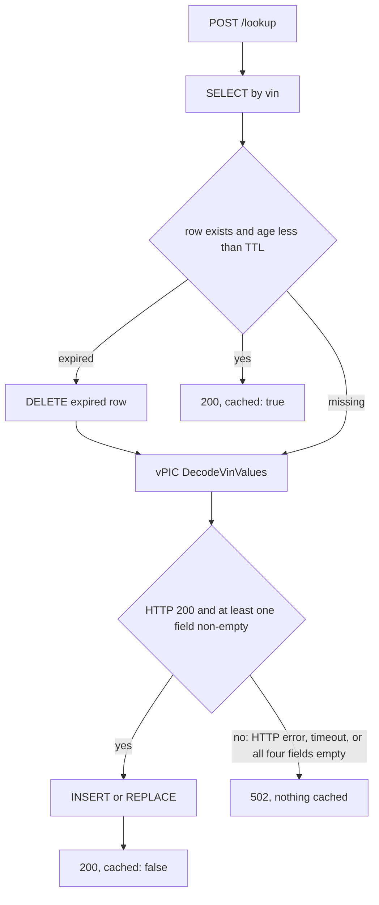
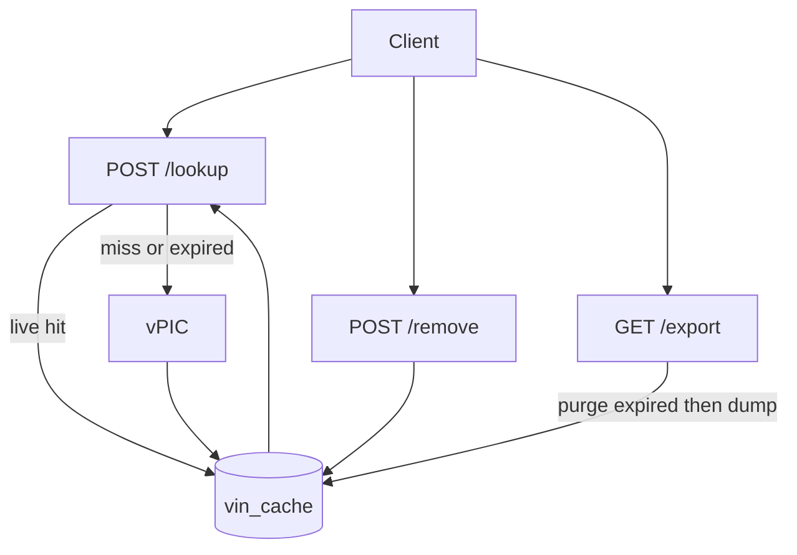

# Simple VIN Decoder Service

A FastAPI app that caches NHTSA vPIC VIN decodes in one SQLite table. JSON, SQL, and parquet use the same column names. `cached` is computed, never stored. The only extra stored field is `cached_at`, for lazy TTL.

This document is a decision log, not just a final-state spec: each design choice below lists the alternatives that were actually on the table, what they'd have cost, and why the chosen option won. The historical build order and per-file "done" record live in [CHECKLIST.md](../../CHECKLIST.md); the interview-facing tradeoffs and production discussion live in [NOTES.md](../../NOTES.md).

## API schema

Lookup and remove are **POST with JSON**. Export is **GET** with no input. VIN: exactly 17 alphanumeric characters, normalized to **uppercase** before any cache key is used.

Snake_case JSON (not the README's display labels). Same names as the table, so there is one schema to remember.

| Option | Tradeoff |
|---|---|
| A. `GET /lookup?vin=...` | RESTful for a read, trivially curl/browser-friendly — but the assignment's wording ("the request should contain a single string called `vin`") reads as a body, and a VIN sitting in a query string ends up in server access logs and browser history |
| B. `POST /lookup` with a JSON body **(chosen)** | Matches the assignment's own wording directly; keeps the VIN out of URLs and logs. Costs some convenience — can't just paste a URL into a browser, worked around with the Phase 6 demo page |

**Why B.** The assignment's own language decided this: "contain a single string" reads as a request body, not a query parameter. `/remove` mirrors `/lookup` for consistency, even though a `DELETE` verb would be more RESTful — the assignment frames all three as fixed named routes, not a resource-oriented API. `/export` stays `GET` because it takes no input and needs to be trivially downloadable (`curl -O -J`, or a plain browser link).

**POST `/lookup`**

Request:

```json
{"vin": "1HGCM82633A004352"}
```

Response:

```json
{
  "vin": "1HGCM82633A004352",
  "make": "HONDA",
  "model": "Accord",
  "model_year": "2003",
  "body_class": "Sedan/Saloon",
  "cached": false
}
```

`cached` is true only when a **live** (unexpired) row was found. It is not a column.

**POST `/remove`**

Request: `{"vin": "..."}`

Response:

```json
{"vin": "1HGCM82633A004352", "deleted": true}
```

`deleted` is true if a row was removed, false if it was not in the cache. HTTP 200 either way.

**GET `/export`**

Parquet attachment of live cache rows only. Columns: `vin`, `make`, `model`, `model_year`, `body_class`. No `cached`, no `cached_at`.

Pydantic models in [`app/schemas.py`](../../app/schemas.py):

- `VinRequest` — `vin: str` with length/charset constraint
- `LookupResponse` — the six lookup fields
- `RemoveResponse` — `vin`, `deleted`

## VIN validation

Pattern: `^[A-Z0-9]{17}$`, applied after uppercasing and stripping whitespace.

| Option | Tradeoff |
|---|---|
| A. Real VIN charset, excluding `I`/`O`/`Q` (`[A-HJ-NPR-Z0-9]{17}`) | Closer to a real VIN — those three letters never appear in one, precisely so they can't be confused with `1`/`0`. But it rejects input the assignment explicitly says to accept ("17 alphanumeric characters"), before vPIC ever gets a chance to say whether the VIN is decodable |
| B. Assignment-literal `[A-Z0-9]{17}` **(chosen)** | Matches the stated requirement exactly. A syntactically valid but semantically nonsense VIN is caught downstream instead — by the vPIC undecodable-VIN check added in Phase 7 (see "vPIC client" below), not at the validation layer |

**Why B.** Validation's job here is to enforce the assignment's contract, not to encode extra VIN-format knowledge the spec didn't ask for. Overriding it with real-world VIN rules would mean silently rejecting input the assignment says should be accepted. Whether a VIN is *real* is vPIC's call, not the request validator's.

## Persistence schema

One table. Four decode fields plus the timestamp needed for TTL. Nothing else (no error codes, no raw vPIC payload, no `cached` flag).

```sql
CREATE TABLE vin_cache (
  vin         TEXT PRIMARY KEY,
  make        TEXT NOT NULL,
  model       TEXT NOT NULL,
  model_year  TEXT NOT NULL,
  body_class  TEXT NOT NULL,
  cached_at   TEXT NOT NULL
);
```

`cached_at` is UTC ISO-8601. Missing vPIC values are stored as `""`, not NULL, so parquet and JSON stay uniform.

| Option | Tradeoff |
|---|---|
| A. Raw `aiosqlite` + hand-written SQL | Fewer dependencies, fully explicit about every query that runs — but connection lifecycle and row-to-object mapping are boilerplate we'd hand-roll for not much payoff on a single table |
| B. SQLAlchemy 2.0 async ORM + `aiosqlite` driver **(chosen)** | Schema is one declarative class instead of hand-written DDL and mapping code; session/transaction handling is library code, not ours; leaves a clear migration path to Postgres later (see NOTES.md, "If this had to handle real traffic") without touching the model layer |

**Why B.** One table alone doesn't justify an ORM, but the async engine/session machinery is needed either way to share a connection pool safely across concurrent async requests — SQLAlchemy gets that for free, plus a straightforward path off SQLite if this ever needed to scale.

## Cache expiration

**Lazy TTL + delete-on-read.** Env var `CACHE_TTL_SECONDS`, default **7 days** (`604800`).

| Option | Tradeoff |
|---|---|
| A. No expiration — cache forever | Simplest possible code. But a bad cached decode never self-heals, and the table grows without bound |
| B. Lazy TTL, delete-on-read **(chosen)** | No background process to run or test; bounds storage opportunistically. Cost: an expired row for a VIN nobody looks up again just sits there until `/export` happens to purge it |
| C. Background purge (scheduled sweep, or on startup) | Keeps storage tight continuously — adds a scheduler as another moving part to run and test, for a demo cache that's realistically tiny |
| D. Scheduled refresh (re-fetch every cached VIN periodically, regardless of access) | Keeps data maximally fresh — wasteful, since VIN attributes essentially never change; most refetches would be pointless vPIC calls |

**Why B.** VIN attributes are static in practice, so "freshness" isn't really the driver here — the TTL exists to bound cache size and let a genuinely bad cached decode age out, not because good decodes go stale. That makes the simplest option also the correct one; C and D solve a staleness problem this domain doesn't really have, at the cost of real infrastructure.



- **Lookup:** live row → hit. Missing or expired → delete expired row if present, call vPIC, upsert with new `cached_at`, `cached: false`. vPIC failure (including an undecodable VIN — see below) → 502, nothing written.
- **Remove:** DELETE by VIN (expired or not). `deleted` reflects whether a row existed.
- **Export:** DELETE expired rows, then SELECT the rest → parquet. Empty cache still yields a valid empty file.
- No background worker. Unused expired rows sit until that VIN is looked up or `/export` runs; that is the tradeoff vs. option C above.

Expired-then-vPIC-fails: we delete the stale row first, then call vPIC. A 502 leaves the VIN uncached — intentional, no stale reads, called out in NOTES.md.

## vPIC client

`GET https://vpic.nhtsa.dot.gov/api/vehicles/DecodeVinValues/{vin}?format=json`

Map `Results[0]` → `make`, `model`, `model_year`, `body_class` only. Shared `httpx.AsyncClient` in lifespan, ~10s timeout. No `modelyear` query param.

vPIC returns HTTP **200** with `Results[0]` present even for a well-formed but undecodable VIN — it just leaves every mapped field blank. Confirmed directly against the live API rather than assumed: `1HGCM82633A004352` (a real sample VIN) comes back with `Make: HONDA`, ..., `ErrorCode: "0"`; `AAAAAAAAAAAAAAAAA` comes back HTTP 200 with `Make`/`Model`/`ModelYear`/`BodyClass` all empty and `ErrorCode: "1,7,400"`. The original (pre-hardening) implementation had no way to tell that apart from a real decode, so a garbage VIN would cache as a false "hit" with empty fields until TTL. This was found and fixed in Phase 7.

| Option | Tradeoff |
|---|---|
| A. Trust vPIC's `ErrorCode` field | vPIC's own signal for "this VIN didn't really decode" — but it's a comma-separated, semi-documented list of numeric codes I could not fully verify the meaning of. Getting that taxonomy wrong risks *rejecting* legitimate decodes (some real, if check-digit-invalid, VINs still carry non-zero codes) |
| B. Accept whatever vPIC returns as long as the HTTP call succeeds (original behavior) | Simplest code — but caches a garbage VIN as a false "hit" with all-empty fields, since vPIC's 200 doesn't mean "decoded successfully" |
| C. Treat a decode where all four target fields come back empty as a failure **(chosen in Phase 7)** | A narrower, self-contained signal I could verify directly against the live API, instead of trusting an error taxonomy I wasn't sure of. Won't catch every vPIC-flagged problem (e.g. a decode with *some* fields populated but a bad check digit still caches) |

**Why C.** Non-200 / timeout / invalid JSON / empty `Results` were always a 502 with nothing written — that part didn't change. What Phase 7 added is: even a 200 with a present `Results[0]` is treated as a failure (502, nothing cached) if `make`, `model`, `model_year`, and `body_class` are *all* empty. It's deliberately narrower than parsing `ErrorCode` (option A) — I chose a rule I could verify with two real API calls over a rule I'd have to trust from documentation I couldn't fully confirm.

## Concurrency

Two robustness gaps were found and closed in Phase 7; a third was considered and deliberately left open. Full discussion in NOTES.md ("Concurrency" and "If this had to handle real traffic").

| Option | Tradeoff |
|---|---|
| A. Default SQLite rollback-journal mode (original) | No extra code — but concurrent writers even within a *single process* (e.g. two overlapping requests from the demo page) raise `database is locked` rather than one waiting for the other |
| B. `PRAGMA journal_mode=WAL` + `PRAGMA busy_timeout=5000` on connect **(chosen)** | Turns that failure into a brief wait instead of an error, within one process. Still one file, one writer at a time — doesn't help across multiple app replicas |
| C. Application-level write lock / queue | Redundant given WAL already resolves the concrete, reproducible failure locally, for more code |
| D. Move to Postgres now | Solves single- and multi-process concurrency together — but adds infrastructure the assignment explicitly scoped as SQLite-backed, for a problem that, within one process, WAL already solves |

**Why B.** It's a two-line fix for a failure mode I could reproduce (two concurrent writers, one process), not a hypothetical. It does not make SQLite safe across multiple replicas — that's D, deliberately deferred to the production discussion in NOTES.md, since the assignment doesn't call for multi-replica deployment.

**Deliberately not implemented: a per-VIN single-flight lock.** Two simultaneous first-lookups of the same uncached VIN each miss the cache and each call vPIC — a thundering-herd duplicate call, not a correctness bug (the second write just overwrites the first with the same data). An in-process `asyncio.Lock` keyed by VIN would collapse that to one call, but it introduces its own tradeoff: a lock table keyed by every VIN ever looked up grows without bound for the life of the process. That's a real production concern (see NOTES.md), not a gap in the delivered app's correctness, so it was named rather than built.

## Request flow



## Testing strategy

| Option | Tradeoff |
|---|---|
| A. Integration tests against the live vPIC API | Real confidence the field mapping is right — but slow, flaky, network-dependent, breaks CI offline, and burns real quota against a third-party service on every run |
| B. Mock vPIC with `respx`, real SQLite in a temp file per test **(chosen)** | Fast, deterministic, fully offline. Cost: the mocks can drift from vPIC's actual response contract if that API's shape changes |

**Why B**, with a mitigation: the Phase 7 "all fields empty" rule (see "vPIC client") wasn't guessed — it was verified by hitting the live API by hand for both a real sample VIN and a garbage one, once, before writing the mocked test around that confirmed shape. The mocks encode a contract that was checked against the real thing, not assumed.

21 tests across `tests/test_api.py`: request validation, lookup miss/hit/expiry, vPIC failure modes (HTTP error, timeout, invalid JSON, empty `Results`, all-fields-empty), remove hit/miss, export (empty, mixed live/expired, exact-TTL boundary), the demo page, and the SQLite WAL/busy-timeout pragmas.

## Packaging & tooling

`pyproject.toml` declares `vin-decoder` as an installable package (`[build-system]`, `[tool.setuptools.packages.find]`), but the documented setup never installs it that way — `README.md` only says `pip install -r requirements.txt` / `requirements-dev.txt`. That mismatch surfaced as a real bug: `pytest` (the bare command, as documented) failed with `ModuleNotFoundError: No module named 'app'` on a properly isolated fresh venv, because pytest's own import-mode only puts `tests/` on `sys.path`, not the repo root — `app` was never actually registered anywhere.

| Option | Tradeoff |
|---|---|
| A. Require `pip install -e .` (editable install) so `app` is a registered package everywhere | "Correct" packaging practice — but nothing in the documented setup does this, so bare `pytest` fails on a genuinely clean install, which is exactly the bug that surfaced |
| B. Add `pythonpath = ["."]` to `[tool.pytest.ini_options]` **(chosen)** | Zero-step fix: makes bare `pytest` behave like `python -m pytest` (which already works, since `-m` always prepends cwd to `sys.path`) and like `uvicorn app.main:app` (which already relies on cwd). No documented install command changes |

**Why B.** It fixes the workflow that's actually documented instead of asking users to remember an extra install step nobody wrote down. Verified by reproducing the exact failure in a properly isolated fresh venv, applying the fix, and re-running `pytest` against that same venv.

## Demo UI

A small page at `GET /` ([`app/static/index.html`](../../app/static/index.html)) so a live demo does not need Postman or curl. It reuses the existing three routes: VIN field, the assignment's sample VINs as clickable chips, lookup / remove / export, a visible `cached` flag, and 422 / 502 surfaced on the page. Hidden from OpenAPI (`include_in_schema=False`).

| Option | Tradeoff |
|---|---|
| A. A JS framework (React/Vue) SPA | Nicer interactivity — but adds a build step and a node toolchain for a three-route demo page |
| B. A single static HTML file, vanilla JS `fetch` calls **(chosen)** | Zero build step, one file, readable top-to-bottom in a five-minute review |

**Why B.** The backend is the deliverable being evaluated; the UI only needs to make it demoable without Postman, not showcase frontend engineering.

## Project layout

- [`app/main.py`](../../app/main.py) — FastAPI app, lifespan (DB + httpx), include router, serve `GET /`
- [`app/static/index.html`](../../app/static/index.html) — demo page (lookup / remove / export)
- [`app/schemas.py`](../../app/schemas.py) — `VinRequest`, `LookupResponse`, `RemoveResponse`
- [`app/routes.py`](../../app/routes.py) — three endpoints
- [`app/db.py`](../../app/db.py) — engine (WAL + busy-timeout pragmas on connect), `VinCache`, get/upsert/delete/purge-expired/list
- [`app/vpic.py`](../../app/vpic.py) — decode client; raises on transport failure *and* on an all-fields-empty decode
- [`app/settings.py`](../../app/settings.py) — `CACHE_TTL_SECONDS` (default 604800), `DATABASE_PATH`, `VPIC_BASE_URL`, `VPIC_TIMEOUT_SECONDS`
- [`tests/`](../../tests/) — validation, hit/miss, expiry-as-miss, undecodable-VIN, remove, export, WAL pragma
- [`pyproject.toml`](../../pyproject.toml) — fastapi, uvicorn, httpx, sqlalchemy, aiosqlite, pyarrow, pytest; `pythonpath = ["."]` so bare `pytest` resolves `app`
- [`requirements.txt`](../../requirements.txt) / [`requirements-dev.txt`](../../requirements-dev.txt) — pip install on a clean machine
- [`README.md`](../../README.md) — run from a clean checkout; how to try sample VINs
- [`ASSIGNMENT.md`](../../ASSIGNMENT.md) — original challenge text
- [`CHECKLIST.md`](../../CHECKLIST.md) — phased implementation checklist, including the Phase 7 hardening pass
- [`NOTES.md`](../../NOTES.md) — schema, TTL, vPIC, concurrency, tradeoffs, production discussion

DB file at `data/cache.db` (gitignored). SQLAlchemy 2.0 async + aiosqlite. Parquet via **pyarrow**.

## Error handling

- Invalid VIN → **422**
- vPIC failure (HTTP error, timeout, invalid JSON, empty `Results`, or all four fields empty) → **502**, nothing written
- Remove miss → **200** + `deleted: false`
- Empty / all-expired export → empty parquet

## Out of scope

No auth, no VIN check-digit validation, no extra API routes, no background purge job, no per-VIN request-coalescing lock, no Postgres migration. No SPA framework, login, field editing, or TTL admin UI. The last three items are discussed as deliberate deferrals — not oversights — in NOTES.md, "If this had to handle real traffic."
