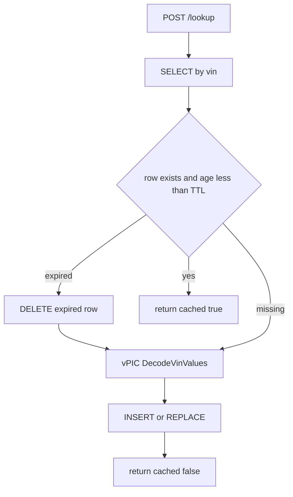
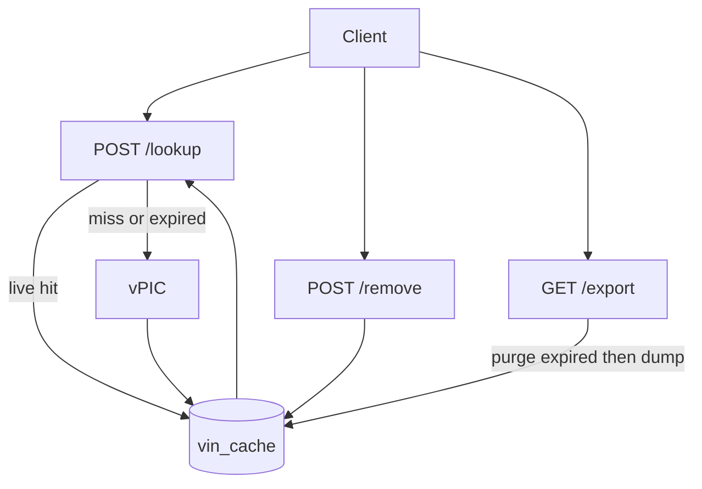

# Simple VIN Decoder Service

A FastAPI app that caches NHTSA vPIC VIN decodes in one SQLite table. JSON, SQL, and parquet use the same column names. `cached` is computed, never stored. The only extra stored field is `cached_at`, for lazy TTL.

## API schema

Lookup and remove are **POST with JSON**. Export is **GET** with no input. VIN: exactly 17 alphanumeric characters, normalized to **uppercase** before any cache key is used.

Snake_case JSON (not the README's display labels). Same names as the table, so there is one schema to remember.

**POST `/lookup`**

Request:

```json

```

Response:

```json
{
  "vin": "1HGCM82633A004352",
  "make": "HONDA",
  "model": "Accord",
  "model_year": "2003",
  "body_class": "Sedan/Saloon",
  "cached": false
}
```

`cached` is true only when a **live** (unexpired) row was found. It is not a column.

**POST `/remove`**

Request: `{"vin": "..."}`

Response:

```json
{"vin": "1HGCM82633A004352", "deleted": true}
```

`deleted` is true if a row was removed, false if it was not in the cache. HTTP 200 either way.

**GET `/export`**

Parquet attachment of live cache rows only. Columns: `vin`, `make`, `model`, `model_year`, `body_class`. No `cached`, no `cached_at`.

Pydantic models in `[app/schemas.py](app/schemas.py)`:

- `VinRequest` — `vin: str` with length/charset constraint
- `LookupResponse` — the six lookup fields
- `RemoveResponse` — `vin`, `deleted`

## Persistence schema

One table. Four decode fields plus the timestamp needed for TTL. Nothing else (no error codes, no raw vPIC payload, no `cached` flag).

```sql
CREATE TABLE vin_cache (
  vin         TEXT PRIMARY KEY,
  make        TEXT NOT NULL,
  model       TEXT NOT NULL,
  model_year  TEXT NOT NULL,
  body_class  TEXT NOT NULL,
  cached_at   TEXT NOT NULL
);
```

`cached_at` is UTC ISO-8601. Missing vPIC values are stored as `""`, not NULL, so parquet and JSON stay uniform.

## Cache expiration (decided)

**Lazy TTL + delete-on-read.** Env var `CACHE_TTL_SECONDS`, default **7 days** (`604800`). VIN attributes almost never change; TTL bounds cache size and lets a bad vPIC response age out.




- **Lookup:** live row → hit. Missing or expired → delete expired row if present, call vPIC, upsert with new `cached_at`, `cached: false`.
- **Remove:** DELETE by VIN (expired or not). `deleted` reflects whether a row existed.
- **Export:** DELETE expired rows, then SELECT the rest → parquet. Empty cache still yields a valid empty file.
- No background worker. Unused expired rows sit until that VIN is looked up or `/export` runs; that is the tradeoff vs a purge-on-startup job.

vPIC failure after an expired delete: **502**, VIN is no longer cached (we already dropped the stale row). Worth a NOTES.md sentence.

## vPIC client

`GET https://vpic.nhtsa.dot.gov/api/vehicles/DecodeVinValues/{vin}?format=json`

Map `Results[0]` → `make`, `model`, `model_year`, `body_class` only. Shared `httpx.AsyncClient` in lifespan, ~10s timeout. Non-200 / timeout / missing `Results` → **502**, do not write. No `modelyear` query param.

## Request flow




## Project layout

- `[app/main.py](app/main.py)` — FastAPI app, lifespan (DB + httpx), include router, serve `GET /`
- `[app/static/index.html](app/static/index.html)` — demo page (lookup / remove / export)
- `[app/schemas.py](app/schemas.py)` — `VinRequest`, `LookupResponse`, `RemoveResponse`
- `[app/routes.py](app/routes.py)` — three endpoints
- `[app/db.py](app/db.py)` — engine, `VinCache`, get/upsert/delete/purge-expired/list
- `[app/vpic.py](app/vpic.py)` — decode client
- `[app/settings.py](app/settings.py)` — `CACHE_TTL_SECONDS` (default 604800)
- `[tests/](tests/)` — validation, hit/miss, expiry-as-miss, remove, export
- `[pyproject.toml](pyproject.toml)` — fastapi, uvicorn, httpx, sqlalchemy, aiosqlite, pyarrow, pytest
- `[requirements.txt](requirements.txt)` / `[requirements-dev.txt](requirements-dev.txt)` — pip install on a clean machine
- `[README.md](README.md)` — run from a clean checkout; how to try sample VINs
- `[ASSIGNMENT.md](ASSIGNMENT.md)` — original challenge text
- `[CHECKLIST.md](CHECKLIST.md)` — phased implementation checklist
- `[NOTES.md](NOTES.md)` — schema, TTL, vPIC, tradeoffs, deploy sketch

DB file at `data/cache.db` (gitignored). SQLAlchemy 2.0 async + aiosqlite. Parquet via **pyarrow**.

## Error handling

- Invalid VIN → **422**
- vPIC failure → **502**
- Remove miss → **200** + `deleted: false`
- Empty / all-expired export → empty parquet

## Phase 6 — Demo UI

A small page at `GET /` (`app/static/index.html`) so a live demo does not need Postman or curl. It reuses the existing three routes. VIN field, assignment sample VIN list, lookup / remove / export, a visible `cached` flag, and 422 / 502 shown on the page. Hidden from OpenAPI (`include_in_schema=False`).

## Out of scope

No auth, no check-digit validation, no extra API routes, no background purge job. No SPA framework, login, field editing, or TTL admin UI.